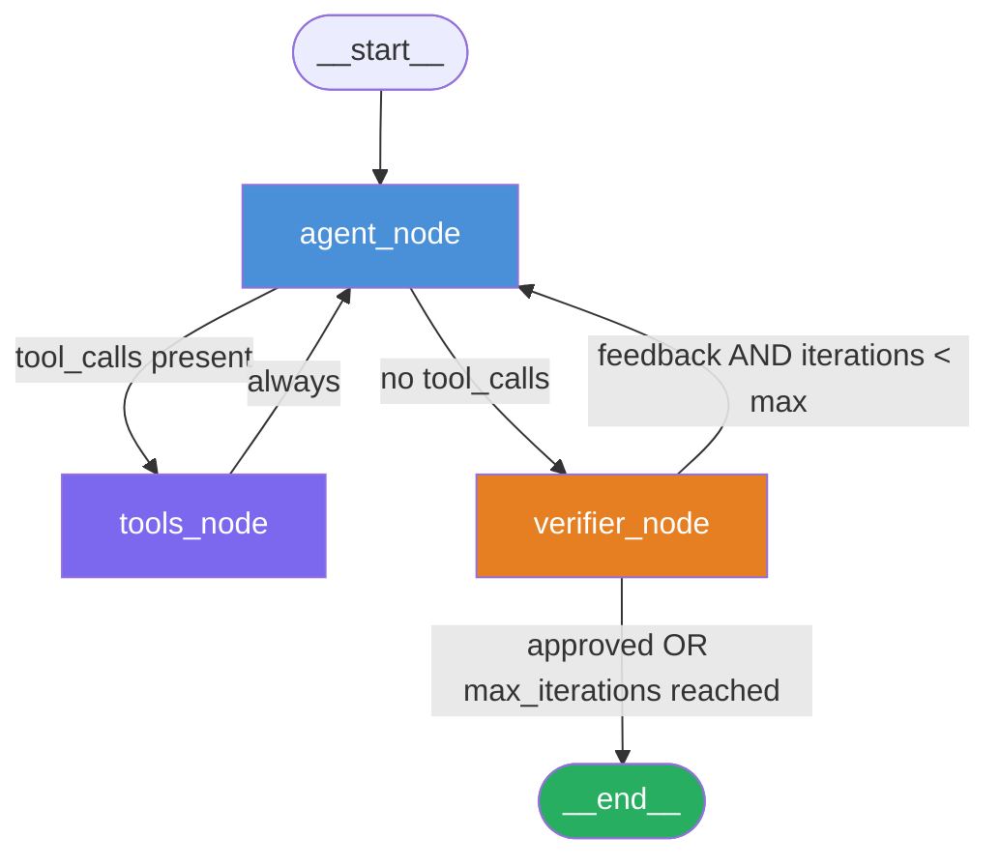

# CLI Chatbot Design Document

**Date**: 2026-03-11
**Status**: Draft
**Prerequisite ADRs**: [ADR-0001 — CLI Chatbot LangGraph Architecture](../adr/ADR-0001-cli-chatbot-langgraph-architecture.md)
**Complexity Level**: Medium
**Complexity Rationale**:
  1. Requirements/ACs: Three distinct states (agent deciding, tools executing, verifier reviewing) plus one async human-interrupt state; conditional routing between them; max-iterations guard that must be enforced at the graph level.
  2. Constraints/Risks: `interrupt()` placement constraint (must precede tool dispatch to avoid double-execution on resume); `operator.add` reducer semantics require append-only message updates; checkpointer lifetime is bound to process lifetime with `InMemorySaver`.

---

## Agreement Checklist

### Scope (what to change)
- Add `code_monkey/agents/cli_chatbot/` package with `state.py`, `nodes.py`, `graph.py`, `ui.py`, `controller.py`, `cli.py`, `tools.py`.
- Add `tests/agents/cli_chatbot/test_graph.py` and `test_controller.py`.
- No changes to existing agents (`web_researcher`, `project_librarian`).
- No changes to shared utilities (`code_monkey/utils/`).
- No changes to `code_monkey/models/models.py`.

### Non-scope (what not to change)
- Persistence layer: `InMemorySaver` only; no durable storage.
- No streaming output to CLI (full response after graph completion).
- No multi-agent orchestration; this is a single-agent loop.
- No web UI or API layer.

### Constraints
- Must use `langgraph.types.interrupt` and `langgraph.types.Command` (not deprecated `NodeInterrupt`).
- Must reuse `get_openai_model()` from `code_monkey/models/models.py`.
- `max_iterations` default is 3; configurable at `build_graph()` call time.
- `operator.add` reducer for `messages` field (append-only).
- Python 3.12, `uv` package manager, `langgraph>=1.0.5` (already installed).

### Performance requirements
- No latency SLAs; this is an interactive CLI tool. LLM round-trip time dominates.

### Reflection in design
- [x] Scope boundary reflected in file structure section and change impact map.
- [x] `interrupt()` placement constraint reflected in `agent_node` code mockup and constraint callout.
- [x] `operator.add` semantics reflected in state schema definition and data representation decision.
- [x] Model factory reuse reflected in graph construction mockup and integration point map.
- [x] `max_iterations` guard reflected in verifier routing function code mockup.

---

## Applicable Standards

| Standard | Source | Classification |
|---|---|---|
| PEP 8 / 88-char line limit / 4-space indent | `pyproject.toml` ruff config | `[explicit]` |
| Type hints on all public functions | `CLAUDE.md` / project rules | `[explicit]` |
| `pytest` for tests; fixtures for setup | `CLAUDE.md` / `pyproject.toml` | `[explicit]` |
| `MagicMock(spec=...)` for mocking; mock at boundary | `CLAUDE.md` testing rules | `[explicit]` |
| Absolute imports (`from x import y`) | `python.md` rules | `[explicit]` |
| No `__init__.py` exports (`__all__`) in application code | `python.md` rules | `[explicit]` |
| Inject dependencies as constructor/factory parameters | Observed in `Summarizer`, `WebResearcher` | `[implicit]` |
| Class-based agents with `__init__` for injected deps | Observed in `WebResearcher`, `ProjectMapper` | `[implicit]` |
| Logging via `logging.getLogger(__name__)` | Observed in `project_mapper.py`, `summarizer.py` | `[implicit]` |

---

## Existing Codebase Analysis

### Implementation Path Mapping

| Path | Status | Relevance |
|---|---|---|
| `code_monkey/agents/web_researcher/web_researcher.py` | Existing | Integration pattern reference: `create_agent` + `InMemorySaver` + `RunnableConfig` |
| `code_monkey/models/models.py` | Existing | Model factory reused by `build_graph()` |
| `code_monkey/utils/langchain_utils.py` | Existing | `last_message_content()` usable in CLI loop |
| `code_monkey/agents/cli_chatbot/` | New | All files to be created |
| `tests/agents/cli_chatbot/` | New | All files to be created |

### Similar Functionality Search

Search keywords: `StateGraph`, `verifier`, `feedback`, `interrupt`, `review`, `Command`.

Result: No existing implementation found in the codebase. The `web_researcher` uses `create_agent` (a prebuilt ReAct wrapper), which does not expose individual node functions or conditional routing. Decision: proceed with new implementation.

### Integration Points with Existing Code

- `code_monkey/models/models.py` → `get_openai_model()` called in `graph.py:build_graph()` as the default model parameter.
- `code_monkey/utils/langchain_utils.py` → `last_message_content()` called in `cli.py` to extract the final text from the state.
- `langgraph.checkpoint.memory.InMemorySaver` → already imported in `web_researcher.py`; used identically in `graph.py`.

### Data Representation Decision

**Assessment**: `messages` field needs an append-only reducer to accumulate history across turns. LangGraph provides two options:
- `add_messages` reducer from `langgraph.graph.message` — handles deduplication by message ID.
- `operator.add` — plain list concatenation, no deduplication.

Per the requirements spec, `operator.add` is mandated. This is appropriate for a CLI chatbot where message IDs are not tracked and deduplication is not needed. Decision: use `operator.add` as specified.

**`review_feedback` and `iteration_count`**: Plain scalar fields with default overwrite reducer. `review_feedback` is `str | None` (reset to `None` when the verifier approves); `iteration_count` is `int` (incremented by `agent_node`, reset to `0` at the start of a new user turn).

---

## Architecture Overview

### Graph Topology

```
                 ┌─────────────────────────────────────────────────┐
                 │              ChatbotGraph (StateGraph)           │
                 │                                                  │
  User Input     │   ┌────────────┐    tool_calls?                  │
 ─────────────►  │   │            │──────────────► ┌─────────────┐ │
                 │   │ agent_node │                │  tools_node │ │
                 │   │            │◄─────────────── └─────────────┘ │
                 │   └─────┬──────┘    (always)                    │
                 │         │                                        │
                 │         │ (no tool_calls)                        │
                 │         ▼                                        │
                 │   ┌──────────────┐   approved?                   │
                 │   │ verifier_node│──────────────────────────────►│ END
                 │   │              │                               │
                 │   └──────────────┘   feedback?                  │
                 │         │                                        │
                 │         │ (max_iterations reached OR approved)  │
                 │         └────────────────────────────────────── ►│ END
                 │         │                                        │
                 │         │ (feedback, iterations < max)           │
                 │         └─────────────────────────────────────►  │
                 │                   (back to agent_node)           │
                 └─────────────────────────────────────────────────┘
```

### ASCII Graph Diagram (node/edge summary)

```
START
  │
  ▼
agent_node
  │
  ├─── [tool_calls present] ──► tools_node ──► agent_node  (loop)
  │
  └─── [no tool_calls] ──► verifier_node
                                │
                                ├─── [approved OR iteration >= max] ──► END
                                │
                                └─── [feedback, iteration < max] ──► agent_node
```

### Mermaid Diagram



---

## State Schema

### Definition (`code_monkey/agents/cli_chatbot/state.py`)

```python
import operator
from typing import Annotated

from langchain_core.messages import BaseMessage
from typing_extensions import TypedDict


class ChatbotState(TypedDict):
    # Append-only message history. operator.add concatenates new messages
    # onto the existing list; nodes must NEVER replace this field wholesale.
    messages: Annotated[list[BaseMessage], operator.add]

    # Feedback text set by verifier_node on rejection; cleared (set to None)
    # when the verifier approves. agent_node reads this to revise its answer.
    review_feedback: str | None

    # Number of complete agent→verifier cycles in the current user turn.
    # Incremented by agent_node at entry. Checked in the verifier routing
    # function to enforce the max_iterations ceiling.
    iteration_count: int
```

### Field Semantics

| Field | Type | Reducer | Responsibility |
|---|---|---|---|
| `messages` | `list[BaseMessage]` | `operator.add` (append) | Full conversation history including tool messages |
| `review_feedback` | `str \| None` | overwrite | Verifier's rejection reason; `None` = approved |
| `iteration_count` | `int` | overwrite | Cycle counter; reset to `0` at start of each new user turn |

### Field Propagation Map

```
User CLI input (str)
    │  wrapped as HumanMessage
    ▼
state["messages"]          [operator.add appends]
    │
    ├──► agent_node reads messages[-N:] for context
    │    → produces AIMessage (possibly with tool_calls)
    │    → appended to state["messages"]
    │    → increments state["iteration_count"]
    │
    ├──► tools_node reads last AIMessage.tool_calls
    │    → produces ToolMessage(s) per call result
    │    → appended to state["messages"]
    │
    └──► verifier_node reads state["messages"][-1] (last AIMessage)
         → sets state["review_feedback"] = None (approved)
            OR state["review_feedback"] = "<reason>" (rejected)
```

Boundary: `review_feedback` is dropped at `END`. The CLI loop reads only `messages[-1]` for display.

> **Mandatory invariant**: Every node return dict for the `messages` key must contain **only the new messages to append** — never the full accumulated list. Returning the full list with `operator.add` will silently double the history. This must be enforced in code review for every node implementation.

---

## Node Responsibilities

### `agent_node` (`code_monkey/agents/cli_chatbot/nodes.py`)

**Responsibility**: Call the LLM with the current message history; optionally call `interrupt()` before dispatch if the agent determines it needs human clarification; return the LLM response as a new `AIMessage`.

**Inputs from state**: `messages`, `review_feedback`, `iteration_count`
**Outputs to state**: `{"messages": [ai_message], "iteration_count": state["iteration_count"] + 1}`

**Key invariants**:
1. `interrupt()` MUST be called before any LLM invocation if clarification is needed. Calling it after appending an `AIMessage` would cause double-invocation on resume.
2. When `review_feedback` is set, the agent prepends a `SystemMessage` describing the feedback before calling the LLM, so the LLM can revise its previous answer.

```python
import logging

from langchain_core.messages import AIMessage, HumanMessage, SystemMessage
from langgraph.types import interrupt

from code_monkey.agents.cli_chatbot.state import ChatbotState

logger = logging.getLogger(__name__)


def make_agent_node(model):
    """Return an agent_node function closed over the given model.

    Args:
        model: Any LangChain BaseChatModel bound with tools via .bind_tools().

    Returns:
        A callable suitable for use as a LangGraph node.
    """

    def agent_node(state: ChatbotState) -> dict:
        logger.debug(
            "agent_node: iteration=%d, feedback=%r",
            state["iteration_count"],
            state["review_feedback"],
        )
        messages = list(state["messages"])

        # If the verifier provided feedback, prepend it as a system instruction
        # so the LLM understands why it must revise.
        if state.get("review_feedback"):
            messages = [
                SystemMessage(
                    content=(
                        f"Your previous response was rejected. "
                        f"Reason: {state['review_feedback']}. "
                        f"Please revise your answer accordingly."
                    )
                )
            ] + messages

        # IMPORTANT: interrupt() must be called HERE, before invoking the LLM,
        # to avoid double-execution of the LLM call on graph resume.
        # The agent decides whether to ask for clarification based on the
        # conversation so far. In practice this check would examine the last
        # HumanMessage for ambiguity indicators.
        last_human = next(
            (m for m in reversed(messages) if isinstance(m, HumanMessage)),
            None,
        )
        if last_human and _needs_clarification(last_human.content):
            clarification = interrupt(
                {"question": "Could you clarify what you mean by that?"}
            )
            # On resume, clarification contains the user's answer (str).
            messages.append(HumanMessage(content=clarification))

        response: AIMessage = model.invoke(messages)
        return {
            "messages": [response],
            "iteration_count": state["iteration_count"] + 1,
        }

    return agent_node


def _needs_clarification(text: str) -> bool:
    """Return True if the agent heuristic determines clarification is needed.

    This is intentionally kept simple; a real implementation would use the
    LLM itself to decide whether to ask.
    """
    ambiguous_phrases = ["it", "that thing", "the other one", "you know what i mean"]
    lower = text.lower()
    return any(phrase in lower for phrase in ambiguous_phrases)
```

### `verifier_node` (`code_monkey/agents/cli_chatbot/nodes.py`)

**Responsibility**: Review the agent's most recent `AIMessage`; set `review_feedback` to `None` if approved, or to a rejection reason string if the response should be revised.

**Inputs from state**: `messages` (reads the last `AIMessage`)
**Outputs to state**: `{"review_feedback": None}` or `{"review_feedback": "<reason>"}`

The verifier is a callable injected at graph construction time. Its signature:

```
verifier: Callable[[str], str | None]
```

where the argument is the agent's response text and the return value is `None` (approved) or a non-empty reason string (rejected).

```python
from langchain_core.messages import AIMessage

from code_monkey.agents.cli_chatbot.state import ChatbotState


def make_verifier_node(verifier):
    """Return a verifier_node function closed over the given verifier callable.

    Args:
        verifier: Callable[[str], str | None].
                  Receives the agent's last response text.
                  Returns None to approve, or a reason string to reject.

    Returns:
        A callable suitable for use as a LangGraph node.
    """

    def verifier_node(state: ChatbotState) -> dict:
        last_ai = next(
            (m for m in reversed(state["messages"]) if isinstance(m, AIMessage)),
            None,
        )
        response_text = last_ai.content if last_ai else ""
        feedback = verifier(response_text)
        return {"review_feedback": feedback}

    return verifier_node
```

### `tools_node` (`code_monkey/agents/cli_chatbot/graph.py`)

**Responsibility**: Execute all tool calls present in the last `AIMessage`. Return one `ToolMessage` per call.

This node is provided by `langgraph.prebuilt.ToolNode` and requires no custom implementation. It is constructed with the same tool list passed to `model.bind_tools(tools)`.

```python
from langgraph.prebuilt import ToolNode

tools_node = ToolNode(tools)
```

---

## Conditional Edge Logic

### `route_after_agent` (agent → tools or verifier)

```python
from langchain_core.messages import AIMessage

from code_monkey.agents.cli_chatbot.state import ChatbotState


def route_after_agent(state: ChatbotState) -> str:
    """Route to tools_node if there are pending tool calls; else to verifier_node."""
    last_message = state["messages"][-1]
    if isinstance(last_message, AIMessage) and last_message.tool_calls:
        return "tools"
    return "verifier"
```

### `route_after_verifier` (verifier → END or agent)

```python
from langgraph.graph import END

from code_monkey.agents.cli_chatbot.state import ChatbotState


def make_route_after_verifier(max_iterations: int):
    """Return a routing function that enforces the max_iterations ceiling.

    Args:
        max_iterations: Maximum number of agent→verifier cycles before
                        forcing the conversation to END regardless of
                        verifier verdict.

    Returns:
        A routing function for the conditional edge after verifier_node.
    """

    def route_after_verifier(state: ChatbotState) -> str:
        if state["review_feedback"] is None:
            # Verifier approved — surface to user.
            return END
        if state["iteration_count"] >= max_iterations:
            # Guard triggered — force END to prevent infinite looping.
            return END
        # Verifier rejected and iterations remain — send feedback back.
        return "agent"

    return route_after_verifier
```

---

## Graph Construction (`code_monkey/agents/cli_chatbot/graph.py`)

```python
import operator
from typing import Callable

from langchain_core.language_models import BaseChatModel
from langgraph.checkpoint.memory import InMemorySaver
from langgraph.graph import END, START, StateGraph
from langgraph.prebuilt import ToolNode

from code_monkey.agents.cli_chatbot.nodes import make_agent_node, make_verifier_node
from code_monkey.agents.cli_chatbot.state import ChatbotState
from code_monkey.models.models import get_openai_model


def make_llm_verifier(model: BaseChatModel) -> Callable[[str], str | None]:
    """Return a verifier backed by an LLM.

    The verifier instructs the LLM to approve or reject the agent's response.
    Returns None for approval, or a reason string for rejection.
    """
    from langchain_core.messages import HumanMessage, SystemMessage

    system = SystemMessage(
        content=(
            "You are a quality reviewer. "
            "Given an AI assistant response, reply with exactly 'APPROVED' "
            "if the response is accurate, complete, and helpful. "
            "Otherwise reply with a concise reason for rejection (1–2 sentences)."
        )
    )

    def _verify(response_text: str) -> str | None:
        result = model.invoke([system, HumanMessage(content=response_text)])
        verdict = result.content.strip()
        if verdict.upper().startswith("APPROVED"):
            return None
        return verdict

    return _verify


def build_graph(
    tools: list,
    model: BaseChatModel | None = None,
    verifier: Callable[[str], str | None] | None = None,
    max_iterations: int = 3,
):
    """Build and compile the CLI chatbot StateGraph.

    Args:
        tools: List of LangChain tool callables to register with the agent.
        model: BaseChatModel to use for the agent node. Defaults to
               get_openai_model() (GPT-4o).
        verifier: Callable[[str], str | None]. Defaults to an LLM-based
                  verifier using the same model. Pass a custom callable for
                  testing or rule-based verification.
        max_iterations: Maximum agent→verifier cycles per user turn before
                        forcing END. Default: 3.

    Returns:
        A compiled LangGraph CompiledStateGraph with InMemorySaver checkpointer.
    """
    if model is None:
        model = get_openai_model()
    bound_model = model.bind_tools(tools)

    if verifier is None:
        verifier = make_llm_verifier(model)

    agent_node = make_agent_node(bound_model)
    verifier_node = make_verifier_node(verifier)
    tools_node = ToolNode(tools)

    graph = StateGraph(ChatbotState)

    graph.add_node("agent", agent_node)
    graph.add_node("tools", tools_node)
    graph.add_node("verifier", verifier_node)

    graph.add_edge(START, "agent")
    graph.add_conditional_edges(
        "agent",
        route_after_agent,
        {"tools": "tools", "verifier": "verifier"},
    )
    graph.add_edge("tools", "agent")
    graph.add_conditional_edges(
        "verifier",
        make_route_after_verifier(max_iterations),
        {"agent": "agent", END: END},
    )

    return graph.compile(checkpointer=InMemorySaver())
```

---

## CLI Loop (`code_monkey/agents/cli_chatbot/cli.py`)

The CLI loop is the only file that interacts with the terminal. It drives the compiled graph through a simple `while True` loop, handling both normal graph completion and interrupt resumption.

```python
import uuid

from langchain_core.messages import HumanMessage
from langgraph.types import Command

from code_monkey.agents.cli_chatbot.graph import build_graph
from code_monkey.agents.cli_chatbot.tools import get_tools
from code_monkey.utils.langchain_utils import last_message_content


def run_cli() -> None:
    """Entry point for the CLI chatbot.

    Drives the compiled graph in a loop, handling user input, interrupt
    resumption, and graph completion.
    """
    tools = get_tools()
    graph = build_graph(tools=tools)
    thread_id = uuid.uuid4().hex
    config = {"configurable": {"thread_id": thread_id}}

    print("CLI Chatbot (type 'exit' to quit)")

    # Each user turn starts with a fresh iteration_count.
    initial_state = {
        "messages": [],
        "review_feedback": None,
        "iteration_count": 0,
    }
    pending_command = None  # holds a Command(resume=...) when resuming an interrupt

    while True:
        if pending_command is None:
            user_input = input("\nYou: ").strip()
            if user_input.lower() == "exit":
                break
            if not user_input:
                continue

            # Start a new turn. Reset iteration_count for this turn.
            state_update = {
                **initial_state,
                "messages": [HumanMessage(content=user_input)],
            }
            invoke_input = state_update
        else:
            # Resume after an interrupt.
            invoke_input = pending_command
            pending_command = None

        # Stream graph events using 'updates' mode so we can detect interrupts.
        # IMPORTANT: stream_mode='values' emits full state snapshots and does NOT
        # surface the '__interrupt__' metadata key. Use stream_mode='updates' which
        # emits per-node deltas where interrupt events appear as {'__interrupt__': (...)}.
        interrupted = False
        for event in graph.stream(invoke_input, config=config, stream_mode="updates"):
            # Check if this update chunk is an interrupt event.
            interrupt_info = _extract_interrupt(event)
            if interrupt_info:
                question = interrupt_info.get("question", "Please provide more info:")
                clarification = input(f"\nAgent asks: {question}\nYou: ").strip()
                pending_command = Command(resume=clarification)
                interrupted = True
                break

        if not interrupted:
            # Graph ran to END — extract and display the final response.
            final_state = graph.get_state(config)
            response = last_message_content({"messages": final_state.values["messages"]})
            print(f"\nAssistant: {response}")


def _extract_interrupt(event: dict) -> dict | None:
    """Return the interrupt payload if the event contains one, else None.

    In stream_mode='updates', LangGraph surfaces interrupt events as chunks
    with the key '__interrupt__' mapping to a tuple of Interrupt objects.
    Each Interrupt object has a .value attribute containing the payload dict
    that was passed to interrupt() inside the node.
    """
    interrupts = event.get("__interrupt__")
    if interrupts:
        # interrupts is a tuple of Interrupt objects; take the first one.
        return interrupts[0].value if interrupts else None
    return None


if __name__ == "__main__":
    run_cli()
```

---

## Controller & UI Abstraction

### Motivation

The `run_cli()` loop above mixes three distinct concerns:

1. **Graph I/O** — streaming events, detecting interrupts, building `Command(resume=...)`
2. **Turn lifecycle** — deciding when to start a new turn vs. resume an interrupted one
3. **Terminal I/O** — calling `input()` and `print()`, formatting output

Coupling these means the graph-driving logic cannot be reused for a TUI, a web socket server, or a headless test harness without duplicating the entire event loop. The Controller + UI Protocol pattern separates them cleanly.

### Layer Diagram

```
┌──────────────────────────────────────────────────────────┐
│  ChatbotController                                       │
│                                                          │
│  • owns the compiled graph + thread_id config            │
│  • manages pending_command (normal turn vs. resumption)  │
│  • streams graph events and translates them to UI calls  │
│  • never calls input() or print() directly               │
└──────────────────────┬───────────────────────────────────┘
                       │ calls methods on
                       ▼
             ┌─────────────────┐
             │   ChatbotUI     │   ← typing.Protocol (structural)
             │   (interface)   │
             └────────┬────────┘
                      │ implemented by
          ┌───────────┴────────────────┐
          │                            │
    ┌─────┴──────┐          ┌──────────┴──────────┐
    │   CliUI    │          │  TextualTUI (future) │
    │ stdin/out  │          │  Textual widgets     │
    └────────────┘          └─────────────────────┘
```

**Data flows**: only `str` crosses the controller→UI boundary. The controller never passes `BaseMessage`, `ChatbotState`, or graph objects to the UI. The UI never touches the graph.

### `ChatbotUI` Protocol (`code_monkey/agents/cli_chatbot/ui.py`)

The UI knows nothing about graphs, interrupts, agents, or conversation roles. It is a generic display + input surface. The controller is the sole holder of semantic knowledge.

```python
from __future__ import annotations

from dataclasses import dataclass, field
from typing import Protocol

# Sentinel for ordinary text input with no special command meaning.
USER_INPUT = "USER_INPUT"


@dataclass
class InputEvent:
    """Value object returned by ChatbotUI.get_input().

    Fields:
        command: A string ID representing the user's intent.
                 Defaults to USER_INPUT for plain text.
                 Examples of other values: "CLEAR", "HELP", "ATTACH_FILE".
                 The controller (not the UI) interprets non-default commands.
        text:    The raw text the user typed, which may also serve as a
                 command argument (e.g. file path, search term).
        files:   Optional list of file paths the user attached or referenced.
    """

    text: str
    command: str = USER_INPUT
    files: list[str] = field(default_factory=list)


class ChatbotUI(Protocol):
    """Generic display and input interface for any rendering backend.

    Knows nothing about LangGraph, interrupts, agents, or conversation roles.
    All values crossing this boundary are plain Python primitives.
    """

    def get_input(self, prompt: str) -> InputEvent:
        """Display prompt and block until the user submits input.

        Returns:
            An InputEvent. text may be empty; command defaults to USER_INPUT.

        Raises:
            SystemExit: user signalled quit (Ctrl+C, Ctrl+D, window close).
        """
        ...

    def assistant_message(self, content: str) -> None:
        """Render a message produced by the AI assistant."""
        ...

    def system_message(self, content: str) -> None:
        """Render an informational message from the system (status, hints, etc.)."""
        ...

    def show_error(self, text: str) -> None:
        """Render an error message."""
        ...
```

### `ChatbotController` (`code_monkey/agents/cli_chatbot/controller.py`)

```python
import uuid
from typing import Any

from langchain_core.messages import HumanMessage
from langgraph.types import Command

from code_monkey.agents.cli_chatbot.ui import ChatbotUI, USER_INPUT
from code_monkey.utils.langchain_utils import last_message_content


class ChatbotController:
    """Drives the compiled graph; delegates all I/O to a ChatbotUI adapter.

    Responsibilities:
      - Own the compiled graph and the per-session thread_id / config.
      - Manage pending_command: Command | None (normal turn vs. interrupt resume).
      - Interpret InputEvent.command values and route accordingly.
      - Stream graph events and translate them into ChatbotUI method calls.

    Not responsible for:
      - How text is rendered (that belongs to the ChatbotUI adapter).
      - Graph construction (caller passes an already-compiled graph).
      - Persistence beyond InMemorySaver (process-local by design).
    """

    def __init__(
        self,
        graph,
        ui: ChatbotUI,
        thread_id: str | None = None,
    ) -> None:
        self._graph = graph
        self._ui = ui
        self._thread_id = thread_id or uuid.uuid4().hex
        self._config = {"configurable": {"thread_id": self._thread_id}}
        self._pending_command: Command | None = None

    @property
    def thread_id(self) -> str:
        return self._thread_id

    def run(self) -> None:
        """Start the interactive loop. Returns when the user signals exit."""
        while True:
            try:
                self._step()
            except SystemExit:
                break
            except Exception as exc:
                self._ui.show_error(str(exc))

    def _step(self) -> None:
        """Execute one controller step: new turn or interrupt resumption."""
        if self._pending_command is not None:
            invoke_input: Any = self._pending_command
            self._pending_command = None
        else:
            event = self._ui.get_input("You:")
            if not event.text and event.command == USER_INPUT:
                return  # empty plain input — re-prompt without advancing graph
            if not self._handle_command(event):
                return  # non-USER_INPUT command was handled; no graph turn
            invoke_input = {
                "messages": [HumanMessage(content=event.text)],
                "review_feedback": None,
                "iteration_count": 0,
            }

        self._ui.system_message("Thinking…")
        interrupted = self._stream_and_handle(invoke_input)

        if not interrupted:
            final_state = self._graph.get_state(self._config)
            response = last_message_content({"messages": final_state.values["messages"]})
            self._ui.assistant_message(response)

    def _handle_command(self, event) -> bool:
        """Process non-USER_INPUT commands. Returns True to proceed with graph turn."""
        if event.command == USER_INPUT:
            return True
        # Extension point: add cases for "CLEAR", "HELP", etc.
        self._ui.system_message(f"Unknown command: {event.command}")
        return False

    def _stream_and_handle(self, invoke_input: Any) -> bool:
        """Stream graph event chunks; return True if an interrupt was detected.

        Translates graph-level interrupt payloads into a plain get_input() call.
        The UI receives only a prompt string — it has no knowledge of interrupts.
        """
        for event in self._graph.stream(
            invoke_input, config=self._config, stream_mode="updates"
        ):
            payload = _extract_interrupt(event)
            if payload is not None:
                # Controller extracts the question and passes it as a prompt.
                # The UI sees a plain get_input() call — no interrupt concept.
                question = payload.get("question", "Please clarify:")
                answer_event = self._ui.get_input(question)
                self._pending_command = Command(resume=answer_event.text)
                return True
        return False


def _extract_interrupt(event: dict) -> dict | None:
    """Return the interrupt payload dict if the update chunk contains one."""
    interrupts = event.get("__interrupt__")
    if interrupts:
        return interrupts[0].value if interrupts else None
    return None
```

### `CliUI` — Terminal Adapter

```python
# code_monkey/agents/cli_chatbot/cli.py

import sys

from code_monkey.agents.cli_chatbot.controller import ChatbotController
from code_monkey.agents.cli_chatbot.graph import build_graph
from code_monkey.agents.cli_chatbot.tools import get_tools


class CliUI:
    """Terminal I/O adapter. Implements ChatbotUI using stdin/stdout."""

    def get_input(self, prompt: str) -> InputEvent:
        try:
            text = input(f"\n{prompt} ").strip()
            return InputEvent(text=text)
        except (EOFError, KeyboardInterrupt):
            raise SystemExit

    def assistant_message(self, content: str) -> None:
        print(f"\nAssistant: {content}")

    def system_message(self, content: str) -> None:
        print(f"[{content}]", end="", flush=True)

    def show_error(self, text: str) -> None:
        print(f"\n[Error] {text}", file=sys.stderr)


def run_cli() -> None:
    """Entry point: wire up CliUI + ChatbotController and start the loop."""
    print("CLI Chatbot (Ctrl+C or Ctrl+D to quit)")
    graph = build_graph(tools=get_tools())
    controller = ChatbotController(graph=graph, ui=CliUI())
    controller.run()


if __name__ == "__main__":
    run_cli()
```

### Future TUI Adapter (illustrative stub, not in current scope)

```python
# code_monkey/agents/cli_chatbot/textual_ui.py  (future)
#
# Demonstrates how a Textual TUI would implement ChatbotUI with no changes
# to ChatbotController, graph.py, nodes.py, or state.py.
#
# from textual.app import App
# from textual.widgets import Input, RichLog
#
# class TextualChatUI:
#     """Textual TUI adapter. Implements ChatbotUI using Textual widgets."""
#
#     def get_input(self, prompt: str) -> InputEvent:
#         # Display prompt label; block on Input widget submit.
#         # Return InputEvent(text=value) for plain input, or
#         # InputEvent(text=arg, command="ATTACH_FILE", files=[path]) for
#         # a file attachment action — all without graph knowledge.
#         ...
#
#     def assistant_message(self, content: str) -> None:
#         # Append content to the assistant chat panel (e.g. a RichLog widget).
#         ...
#
#     def system_message(self, content: str) -> None:
#         # Update the Footer status bar widget.
#         ...
#
#     def show_error(self, text: str) -> None:
#         # Show a dismissible error notification toast.
#         ...
```

### Controller–UI Contract Summary

| Method | Called when (by controller) | Returns | May raise |
|---|---|---|---|
| `get_input(prompt)` | New turn start; also on interrupt (question as prompt) | `InputEvent` | `SystemExit` to quit |
| `assistant_message(content)` | Graph reaches END normally | — | — |
| `system_message(content)` | Before graph invocation; any informational hint | — | — |
| `show_error(text)` | Any unhandled exception in `_step()` | — | — |

**Key constraints**:
- The only values crossing the controller→UI boundary are plain Python primitives (`str`, `list[str]`). The UI never sees `BaseMessage`, `ChatbotState`, or any LangGraph type.
- The UI has no concept of "interrupt" or "clarification". When the graph interrupts, the controller extracts the question text and calls `get_input(question)` — the same method used for normal user turns. The UI sees a prompt and returns an `InputEvent`.
- `InputEvent.command` is interpreted exclusively by the controller. The UI produces it (e.g. from a keyboard shortcut or slash-command parser) but never acts on it.

### Testing the Controller with a Mock UI

The controller can be unit-tested without a terminal by injecting a `MockUI`:

```python
from unittest.mock import MagicMock
from langchain_core.language_models import BaseChatModel
from langchain_core.messages import AIMessage

from code_monkey.agents.cli_chatbot.controller import ChatbotController
from code_monkey.agents.cli_chatbot.graph import build_graph


class MockUI:
    """Scriptable ChatbotUI for controller tests.

    Feeds pre-set InputEvents via get_input(); records all display calls.
    Has no knowledge of graphs, interrupts, or conversation roles.
    """

    def __init__(self, inputs: list[InputEvent]) -> None:
        self._inputs = iter(inputs)
        self.prompts: list[str] = []          # every prompt passed to get_input()
        self.assistant_messages: list[str] = []
        self.system_messages: list[str] = []
        self.errors: list[str] = []

    def get_input(self, prompt: str) -> InputEvent:
        self.prompts.append(prompt)
        try:
            return next(self._inputs)
        except StopIteration:
            raise SystemExit

    def assistant_message(self, content: str) -> None:
        self.assistant_messages.append(content)

    def system_message(self, content: str) -> None:
        self.system_messages.append(content)

    def show_error(self, text: str) -> None:
        self.errors.append(text)


def test_controller_delivers_response_to_ui():
    """AC-9: Controller passes the final response to ui.assistant_message."""
    model = MagicMock(spec=BaseChatModel)
    model.bind_tools.return_value = model
    model.invoke.return_value = AIMessage(content="Hello there.")

    graph = build_graph(tools=[], model=model, verifier=lambda _: None)
    ui = MockUI(inputs=[InputEvent(text="Hi")])
    controller = ChatbotController(graph=graph, ui=ui)
    controller.run()  # exits when MockUI raises SystemExit on input exhaustion

    assert ui.assistant_messages == ["Hello there."]
    assert ui.errors == []


def test_controller_routes_interrupt_through_ui():
    """AC-10: On interrupt, controller calls ui.get_input with the question as prompt."""
    from langgraph.checkpoint.memory import InMemorySaver
    from langgraph.graph import END, START, StateGraph
    from langgraph.types import interrupt as lg_interrupt
    from langchain_core.messages import HumanMessage

    from code_monkey.agents.cli_chatbot.state import ChatbotState

    done = {"v": False}

    def agent_that_interrupts(state: ChatbotState) -> dict:
        if not done["v"]:
            done["v"] = True
            clarification = lg_interrupt({"question": "What do you mean?"})
            return {
                "messages": [HumanMessage(content=clarification)],
                "iteration_count": state["iteration_count"] + 1,
            }
        return {
            "messages": [AIMessage(content="Got it.")],
            "iteration_count": state["iteration_count"] + 1,
        }

    g = StateGraph(ChatbotState)
    g.add_node("agent", agent_that_interrupts)
    g.add_edge(START, "agent")
    g.add_edge("agent", END)
    compiled = g.compile(checkpointer=InMemorySaver())

    # Feed: first user turn input, then the clarification answer.
    ui = MockUI(inputs=[
        InputEvent(text="Rename that thing"),
        InputEvent(text="The main() function"),
    ])
    controller = ChatbotController(graph=compiled, ui=ui)
    controller.run()

    # The UI saw "What do you mean?" as a plain prompt — no interrupt concept.
    assert "What do you mean?" in ui.prompts
    assert ui.assistant_messages == ["Got it."]
```

---

## Annotated Use Case Code Mockups

### Use Case A: Straight-Through Turn (user input → agent → tool call → verifier approves → CLI output)

This is the happy path: the agent decides to call a tool, the tool executes, the agent incorporates the result, and the verifier approves on the first cycle.

```python
# Sequence of state transitions for a straight-through turn
#
# Initial state (new turn):
#   messages:        [HumanMessage("What is the capital of France?")]
#   review_feedback: None
#   iteration_count: 0
#
# --- agent_node executes ---
#   - No interrupt needed (no ambiguity in "capital of France")
#   - LLM decides to call the search tool
#   - Returns: AIMessage(tool_calls=[ToolCall(name="search", args={"query": "capital France"})])
#
# State after agent_node:
#   messages:        [HumanMessage(...), AIMessage(tool_calls=[...])]
#   iteration_count: 1
#
# route_after_agent → "tools"  (tool_calls present)
#
# --- tools_node executes ---
#   - Runs search("capital France") → "Paris"
#   - Returns: ToolMessage(content="Paris", tool_call_id=<id>)
#
# State after tools_node:
#   messages:        [..., AIMessage(tool_calls=[...]), ToolMessage("Paris")]
#
# route_after_agent (back to agent via edge) → agent_node
#
# --- agent_node executes again ---
#   - No interrupt; review_feedback still None
#   - LLM reads ToolMessage, composes final answer
#   - Returns: AIMessage(content="The capital of France is Paris.")
#
# State after second agent_node:
#   messages:        [..., AIMessage("The capital of France is Paris.")]
#   iteration_count: 2
#
# route_after_agent → "verifier"  (no tool_calls in last message)
#
# --- verifier_node executes ---
#   - Evaluates "The capital of France is Paris." → APPROVED
#   - Returns: {"review_feedback": None}
#
# State after verifier_node:
#   review_feedback: None
#
# route_after_verifier → END  (review_feedback is None)
#
# CLI output: "The capital of France is Paris."
```

### Use Case B: Verifier Feedback Loop (verifier rejects → agent revises → verifier approves)

This case shows the feedback cycle. The verifier rejects the first agent response (e.g., it is incomplete), provides a reason, and the agent produces a revised response that is approved.

```python
# Initial state (new turn):
#   messages:        [HumanMessage("Explain async/await in Python")]
#   review_feedback: None
#   iteration_count: 0
#
# --- First agent_node cycle ---
#   - No interrupt; no tool calls
#   - LLM returns a brief, incomplete answer
#   - Returns: AIMessage(content="async/await lets you write async code.")
#
# State after agent_node:
#   messages:        [..., AIMessage("async/await lets you write async code.")]
#   iteration_count: 1
#
# route_after_agent → "verifier"
#
# --- verifier_node (cycle 1) ---
#   - Evaluates response → rejects (too brief, missing event loop explanation)
#   - Returns: {"review_feedback": "The answer is too brief. Explain the event loop and provide an example."}
#
# State:
#   review_feedback: "The answer is too brief. Explain the event loop and provide an example."
#   iteration_count: 1  (< max_iterations=3)
#
# route_after_verifier → "agent"  (feedback present, under limit)
#
# --- Second agent_node cycle ---
#   - review_feedback is set → prepends SystemMessage with feedback
#   - messages passed to LLM: [SystemMessage("Your previous response was rejected. Reason: ..."), HumanMessage(...), AIMessage(...)]
#   - LLM produces expanded answer with event loop explanation and code example
#   - Returns: AIMessage(content="async/await in Python works with the event loop...")
#
# State after second agent_node:
#   messages:        [..., AIMessage("async/await in Python works with the event loop...")]
#   iteration_count: 2
#   review_feedback: "..." (still set until verifier runs)
#
# route_after_agent → "verifier"
#
# --- verifier_node (cycle 2) ---
#   - Evaluates expanded response → APPROVED
#   - Returns: {"review_feedback": None}
#
# route_after_verifier → END
#
# CLI output: "async/await in Python works with the event loop..."
```

### Use Case C: Mid-Agent Clarification Interrupt (agent calls `interrupt()` → CLI prompt → `Command(resume=...)` → agent continues)

This case demonstrates the human-in-the-loop interrupt. The agent encounters an ambiguous input, pauses via `interrupt()`, the CLI asks the user for clarification, and graph execution resumes with the user's answer.

```python
# Initial state (new turn):
#   messages:        [HumanMessage("Rename that thing")]
#   review_feedback: None
#   iteration_count: 0
#
# --- agent_node executes ---
#   - _needs_clarification("Rename that thing") → True ("that thing" is ambiguous)
#   - interrupt({"question": "Could you clarify what you mean by that?"}) is called
#   - Graph execution PAUSES here; state is checkpointed by InMemorySaver
#   - LangGraph surfaces the interrupt via __interrupt__ key in the streamed event
#
# CLI loop detects __interrupt__ in the stream event:
#   - Extracts question: "Could you clarify what you mean by that?"
#   - Prints: "Agent asks: Could you clarify what you mean by that?"
#   - User types: "The 'main' function in main.py"
#   - CLI sets pending_command = Command(resume="The 'main' function in main.py")
#
# Next CLI iteration: invoke_input = Command(resume="The 'main' function in main.py")
#
# --- agent_node RESUMES from the interrupt() call ---
#   - interrupt() returns "The 'main' function in main.py"  (the resume value)
#   - appends HumanMessage("The 'main' function in main.py") to messages
#   - invokes LLM with clarified context
#   - Returns: AIMessage(content="I'll rename the 'main' function...")
#
# State after resumed agent_node:
#   messages:        [HumanMessage("Rename that thing"),
#                     HumanMessage("The 'main' function in main.py"),
#                     AIMessage("I'll rename the 'main' function...")]
#   iteration_count: 1
#
# route_after_agent → "verifier"  (no tool_calls)
#
# --- verifier_node ---
#   - APPROVED
#
# route_after_verifier → END
#
# CLI output: "I'll rename the 'main' function..."
```

---

## Integration Point Map

```yaml
Integration Point 1:
  Existing Component: code_monkey/models/models.py :: get_openai_model()
  Integration Method: Call Addition (called in build_graph() as default model)
  Impact Level: Low (read-only, no modification to models.py)
  Required Test Coverage: Tests that call build_graph() with an injected mock model
                          confirm the model factory is not called in test paths.

Integration Point 2:
  Existing Component: code_monkey/utils/langchain_utils.py :: last_message_content()
  Integration Method: Call Addition (called in cli.py to extract final response text)
  Impact Level: Low (read-only utility function)
  Required Test Coverage: CLI loop tests verify the extracted response matches
                          the last AIMessage content.

Integration Point 3:
  Existing Component: langgraph.checkpoint.memory.InMemorySaver
  Integration Method: Constructor Parameter (passed to graph.compile())
  Impact Level: Low (already imported and used by web_researcher)
  Required Test Coverage: Interrupt resumption test verifies that graph state
                          is preserved across two separate stream() calls with
                          the same thread_id.
```

---

## Change Impact Map

```yaml
Change Target: New package code_monkey/agents/cli_chatbot/
Direct Impact:
  - code_monkey/agents/cli_chatbot/state.py (new)
  - code_monkey/agents/cli_chatbot/nodes.py (new)
  - code_monkey/agents/cli_chatbot/graph.py (new)
  - code_monkey/agents/cli_chatbot/ui.py (new — ChatbotUI Protocol)
  - code_monkey/agents/cli_chatbot/controller.py (new — ChatbotController)
  - code_monkey/agents/cli_chatbot/cli.py (new — CliUI + run_cli())
  - code_monkey/agents/cli_chatbot/tools.py (new)
  - tests/agents/cli_chatbot/test_graph.py (new)
  - tests/agents/cli_chatbot/test_controller.py (new)
Indirect Impact:
  - code_monkey/models/models.py (called by graph.py; no change to models.py itself)
  - code_monkey/utils/langchain_utils.py (called by cli.py; no change to langchain_utils.py itself)
No Ripple Effect:
  - code_monkey/agents/web_researcher/ (completely independent)
  - code_monkey/agents/project_librarian/ (completely independent)
  - pyproject.toml (langgraph already present as dependency)
```

---

## Interface Change Matrix

| Existing Operation | New Operation | Conversion Required | Adapter Required | Compatibility Method |
|---|---|---|---|---|
| `create_agent(model, tools, checkpointer, system_prompt)` in web_researcher | `build_graph(tools, model, verifier, max_iterations)` in cli_chatbot | None (independent codepath) | Not required | No shared interface; both coexist |
| `get_openai_model()` in models.py | Same, called by build_graph() | None | Not required | Unchanged call site |
| `last_message_content(state)` in langchain_utils.py | Same, called by cli.py | None | Not required | Unchanged call site |

---

## Integration Boundary Contracts

```yaml
Boundary: CLI loop → compiled graph
  Input: dict with keys "messages" (list[BaseMessage]), "review_feedback" (str|None), "iteration_count" (int)
         OR Command(resume=<str>) on interrupt resumption
  Output: Iterable of update chunks (stream_mode="updates"); each chunk is a per-node state delta or an interrupt event dict
          Side-effect: checkpointed state accessible via graph.get_state(config)
  On Error: LangGraph propagates node exceptions; CLI loop should catch Exception and print error to stderr

Boundary: agent_node → verifier_node
  Input: Full ChatbotState; verifier_node reads state["messages"][-1] (last AIMessage)
  Output: {"review_feedback": str | None}
  On Error: If no AIMessage found in messages, review_feedback is set to None (approve to avoid blocking)

Boundary: verifier callable → verifier_node
  Input: str (agent's last response text)
  Output: str | None  (None = approved; non-empty str = rejection reason)
  On Error: If verifier raises, the exception propagates to the graph and the CLI loop

Boundary: interrupt() → CLI loop
  Input: dict with "question" key (JSON-serializable)
  Output: str (user's clarification text) via Command(resume=<str>)
  On Error: If user types empty string, CLI loop retries the input prompt (not yet implemented; future work)
```

---

## Implementation Approach

**Selected strategy**: Vertical Slice.

Each file (`state.py`, `nodes.py`, `graph.py`, `cli.py`, `tools.py`) is independently implementable, and the entire feature can be delivered in a single end-to-end slice: a user runs `cli.py`, types a message, and receives a verified response. There are no cross-cutting concerns with existing agents.

**Rationale** (Phase 1–4 of implementation-approach framework):
1. The existing codebase has no shared state management infrastructure; the cli_chatbot package is self-contained.
2. No common foundation (database, shared service) needs to exist first.
3. Risk is low: langgraph is already installed; `interrupt()` and `ToolNode` are stable APIs.
4. Constraints are satisfied by a single slice: `langgraph>=1.0.5` is in `pyproject.toml`; Python 3.12 is required.

**Integration point**: The system is operational when `cli.py` can be executed and completes a straight-through turn (Use Case A) end-to-end.

---

## Testing Approach

### Guiding Principles

- Mock the LLM at the boundary: inject a `MagicMock(spec=BaseChatModel)` that returns deterministic `AIMessage` objects.
- Mock the verifier callable: pass a lambda `lambda text: None` (always approve) or `lambda text: "too brief"` (always reject) to exercise routing.
- Do not mock `ToolNode`, `StateGraph`, `InMemorySaver`, or routing functions — let the real graph run.
- Assert on the full final state (exact `messages` list content), not on which internal functions were called.

### Test File Structure

```
tests/agents/cli_chatbot/
└── test_graph.py
```

### Key Test Cases (`tests/agents/cli_chatbot/test_graph.py`)

```python
"""Tests for the CLI chatbot graph."""

import operator
from typing import Annotated
from unittest.mock import MagicMock

import pytest
from langchain_core.language_models import BaseChatModel
from langchain_core.messages import AIMessage, BaseMessage, HumanMessage, ToolMessage
from langchain_core.tools import tool
from langgraph.types import Command

from code_monkey.agents.cli_chatbot.graph import build_graph
from code_monkey.agents.cli_chatbot.state import ChatbotState


# ---------------------------------------------------------------------------
# Shared fixtures
# ---------------------------------------------------------------------------

@tool
def add_numbers(a: int, b: int) -> int:
    """Add two numbers and return the result."""
    return a + b


def make_mock_model(responses: list[AIMessage]) -> MagicMock:
    """Return a mock BaseChatModel that cycles through the given responses."""
    model = MagicMock(spec=BaseChatModel)
    model.bind_tools.return_value = model
    call_count = {"n": 0}

    def invoke_side_effect(messages):
        response = responses[min(call_count["n"], len(responses) - 1)]
        call_count["n"] += 1
        return response

    model.invoke.side_effect = invoke_side_effect
    return model


THREAD_CONFIG = {"configurable": {"thread_id": "test-thread-001"}}


# ---------------------------------------------------------------------------
# TestStraightThrough
# ---------------------------------------------------------------------------

class TestStraightThrough:
    """Use Case A: user input → agent → (no tools) → verifier approves → END."""

    def test_final_response_is_agent_output(self):
        model = make_mock_model([AIMessage(content="The capital of France is Paris.")])
        graph = build_graph(
            tools=[add_numbers],
            model=model,
            verifier=lambda text: None,  # always approve
        )
        initial = {
            "messages": [HumanMessage(content="What is the capital of France?")],
            "review_feedback": None,
            "iteration_count": 0,
        }
        final = graph.invoke(initial, config=THREAD_CONFIG)

        last_ai = next(
            m for m in reversed(final["messages"]) if isinstance(m, AIMessage)
        )
        assert last_ai.content == "The capital of France is Paris."


# ---------------------------------------------------------------------------
# TestVerifierFeedbackLoop
# ---------------------------------------------------------------------------

class TestVerifierFeedbackLoop:
    """Use Case B: verifier rejects first response; agent revises; verifier approves."""

    def test_agent_revises_after_rejection(self):
        responses = [
            AIMessage(content="Brief answer."),           # first attempt (rejected)
            AIMessage(content="Detailed answer with example."),  # revision (approved)
        ]
        model = make_mock_model(responses)

        call_count = {"n": 0}

        def verifier(text: str) -> str | None:
            call_count["n"] += 1
            if call_count["n"] == 1:
                return "Too brief. Add more detail."
            return None

        graph = build_graph(tools=[], model=model, verifier=verifier)
        initial = {
            "messages": [HumanMessage(content="Explain async/await")],
            "review_feedback": None,
            "iteration_count": 0,
        }
        final = graph.invoke(initial, config=THREAD_CONFIG)

        last_ai = next(
            m for m in reversed(final["messages"]) if isinstance(m, AIMessage)
        )
        assert last_ai.content == "Detailed answer with example."
        assert final["review_feedback"] is None


# ---------------------------------------------------------------------------
# TestMaxIterationsGuard
# ---------------------------------------------------------------------------

class TestMaxIterationsGuard:
    """Verifier always rejects; graph must terminate at max_iterations."""

    def test_graph_terminates_at_max_iterations(self):
        responses = [AIMessage(content=f"Attempt {i}") for i in range(10)]
        model = make_mock_model(responses)

        graph = build_graph(
            tools=[],
            model=model,
            verifier=lambda text: "Always rejected",  # never approves
            max_iterations=2,
        )
        initial = {
            "messages": [HumanMessage(content="Tell me something")],
            "review_feedback": None,
            "iteration_count": 0,
        }
        final = graph.invoke(initial, config=THREAD_CONFIG)

        # Graph must have terminated; iteration_count must equal max_iterations.
        assert final["iteration_count"] == 2


# ---------------------------------------------------------------------------
# TestInterruptResumption
# ---------------------------------------------------------------------------

class TestInterruptResumption:
    """Use Case C: agent calls interrupt(); CLI resumes via Command(resume=...)."""

    def test_graph_resumes_with_clarification(self):
        """Verify the graph pauses on interrupt and continues after Command(resume=...)."""
        from langgraph.types import interrupt as lg_interrupt

        # Build a minimal agent that always interrupts on the first invocation.
        first_call = {"done": False}

        def agent_that_interrupts(state: ChatbotState) -> dict:
            if not first_call["done"]:
                first_call["done"] = True
                clarification = lg_interrupt({"question": "What do you mean?"})
                return {
                    "messages": [HumanMessage(content=clarification)],
                    "iteration_count": state["iteration_count"] + 1,
                }
            return {
                "messages": [AIMessage(content="Got it, proceeding.")],
                "iteration_count": state["iteration_count"] + 1,
            }

        from langgraph.checkpoint.memory import InMemorySaver
        from langgraph.graph import END, START, StateGraph

        from code_monkey.agents.cli_chatbot.state import ChatbotState

        graph = StateGraph(ChatbotState)
        graph.add_node("agent", agent_that_interrupts)
        graph.add_edge(START, "agent")
        graph.add_edge("agent", END)
        compiled = graph.compile(checkpointer=InMemorySaver())

        thread = {"configurable": {"thread_id": "interrupt-test"}}
        initial = {
            "messages": [HumanMessage(content="Rename that thing")],
            "review_feedback": None,
            "iteration_count": 0,
        }

        # First invocation — graph pauses at interrupt()
        # Use stream_mode='updates' so __interrupt__ events are surfaced in the chunks.
        events = list(compiled.stream(initial, config=thread, stream_mode="updates"))
        interrupted = any("__interrupt__" in e for e in events)
        assert interrupted

        # Resume with user's clarification
        resume_events = list(
            compiled.stream(
                Command(resume="The main() function"),
                config=thread,
                stream_mode="updates",
            )
        )
        final_state = compiled.get_state(thread)
        last_ai = next(
            (m for m in reversed(final_state.values["messages"])
             if isinstance(m, AIMessage)),
            None,
        )
        assert last_ai is not None
        assert last_ai.content == "Got it, proceeding."
```

### TestToolCall (AC-8)

```python
class TestToolCall:
    """AC-8: ToolNode executes tool calls and appends ToolMessage to state."""

    def test_tool_call_produces_tool_message(self):
        """Verify that an agent response with tool_calls triggers ToolNode execution."""
        from unittest.mock import MagicMock
        from langchain_core.language_models import BaseChatModel
        from langchain_core.messages import AIMessage, HumanMessage, ToolMessage
        from langchain_core.tools import tool
        from langgraph.types import Command
        from code_monkey.agents.cli_chatbot.graph import build_graph

        @tool
        def add_numbers(a: int, b: int) -> int:
            """Add two numbers together."""
            return a + b

        # First model call: return an AIMessage with a tool_call.
        # Second model call (after ToolNode): return a plain AIMessage using the result.
        tool_call_msg = AIMessage(
            content="",
            tool_calls=[{"id": "tc1", "name": "add_numbers", "args": {"a": 3, "b": 4}}],
        )
        final_msg = AIMessage(content="The sum of 3 and 4 is 7.")

        model = MagicMock(spec=BaseChatModel)
        model.bind_tools.return_value = model
        model.invoke.side_effect = [tool_call_msg, final_msg]

        # Verifier always approves.
        graph = build_graph(model=model, tools=[add_numbers], verifier=lambda _: None)
        config = {"configurable": {"thread_id": "tool-call-test"}}

        initial = {
            "messages": [HumanMessage(content="What is 3 + 4?")],
            "review_feedback": None,
            "iteration_count": 0,
        }
        final_state = graph.invoke(initial, config=config)

        # Verify a ToolMessage with the computed result is in state.
        tool_messages = [m for m in final_state["messages"] if isinstance(m, ToolMessage)]
        assert len(tool_messages) == 1
        assert tool_messages[0].content == "7"  # add_numbers returns int; ToolNode serialises to str

        # Verify the final AIMessage incorporates the result.
        last_ai = next(
            (m for m in reversed(final_state["messages"]) if isinstance(m, AIMessage)),
            None,
        )
        assert last_ai is not None
        assert last_ai.content == "The sum of 3 and 4 is 7."
```

### Testing the Verifier in Isolation

The verifier is a plain `Callable[[str], str | None]`. It can be tested without any graph:

```python
def test_llm_verifier_approves_good_response():
    from unittest.mock import MagicMock
    from langchain_core.messages import AIMessage
    from langchain_core.language_models import BaseChatModel
    from code_monkey.agents.cli_chatbot.graph import make_llm_verifier

    model = MagicMock(spec=BaseChatModel)
    model.invoke.return_value = AIMessage(content="APPROVED")
    verifier = make_llm_verifier(model)

    result = verifier("The capital of France is Paris.")
    assert result is None


def test_llm_verifier_rejects_bad_response():
    from unittest.mock import MagicMock
    from langchain_core.messages import AIMessage
    from langchain_core.language_models import BaseChatModel
    from code_monkey.agents.cli_chatbot.graph import make_llm_verifier

    model = MagicMock(spec=BaseChatModel)
    model.invoke.return_value = AIMessage(content="The response is factually incorrect.")
    verifier = make_llm_verifier(model)

    result = verifier("Paris is in Germany.")
    assert result == "The response is factually incorrect."
```

---

## File Structure

```
code_monkey/agents/cli_chatbot/
├── state.py        # ChatbotState TypedDict with operator.add reducer
├── nodes.py        # make_agent_node(), make_verifier_node(), routing functions
├── graph.py        # build_graph(), make_llm_verifier()
├── ui.py           # ChatbotUI Protocol (structural interface)
├── controller.py   # ChatbotController — graph driver, UI-agnostic
├── cli.py          # CliUI adapter + run_cli() entry point
└── tools.py        # get_tools() — returns list of LangChain tool callables

tests/agents/cli_chatbot/
├── test_graph.py        # Graph-level tests: straight-through, feedback loop, interrupt, tool call
└── test_controller.py   # Controller-level tests: MockUI, turn lifecycle, interrupt routing
```

---

## Acceptance Criteria

### Feature Acceptance Criteria

| # | Criterion | Test Location |
|---|---|---|
| AC-1 | Given a user message with no tool calls, the graph reaches END in one agent→verifier cycle when the verifier approves | `TestStraightThrough::test_final_response_is_agent_output` |
| AC-2 | The final `AIMessage` content in state equals the agent's last response text | `TestStraightThrough::test_final_response_is_agent_output` |
| AC-3 | When the verifier rejects the first response, the agent is invoked again and the second response appears as the final message | `TestVerifierFeedbackLoop::test_agent_revises_after_rejection` |
| AC-4 | `review_feedback` is `None` in final state after verifier approval | `TestVerifierFeedbackLoop::test_agent_revises_after_rejection` |
| AC-5 | When the verifier always rejects and `max_iterations=2`, the graph terminates after exactly 2 agent invocations | `TestMaxIterationsGuard::test_graph_terminates_at_max_iterations` |
| AC-6 | When the agent calls `interrupt()`, the graph pauses and the `__interrupt__` key appears in the streamed event | `TestInterruptResumption::test_graph_resumes_with_clarification` |
| AC-7 | After `Command(resume=<str>)`, the graph resumes from the interrupt point and the final AIMessage is the post-clarification response | `TestInterruptResumption::test_graph_resumes_with_clarification` |
| AC-8 | When the agent generates tool calls, the `tools_node` executes them and the result appears as a `ToolMessage` in `state["messages"]` before the next agent invocation | `TestToolCall::test_tool_call_produces_tool_message` |
| AC-9 | `ChatbotController.run()` calls `ui.assistant_message(<content>)` with the final AIMessage content when the graph completes normally | `test_controller.py::test_controller_delivers_response_to_ui` |
| AC-10 | When the graph emits an interrupt, the controller calls `ui.get_input(<question>)` (question as plain prompt) and resumes the graph with `Command(resume=InputEvent.text)` | `test_controller.py::test_controller_routes_interrupt_through_ui` |

### Non-Functional Requirements

| Requirement | Approach |
|---|---|
| Testability without live LLM | All graph tests inject `MagicMock(spec=BaseChatModel)` and lambda verifiers |
| No regressions in existing agents | Existing test suites for `web_researcher` and `project_librarian` continue to pass unchanged |
| `max_iterations` configurable | `build_graph(max_iterations=N)` parameter; default 3 |

---

## E2E Verification Procedures

### Phase Integration Verification

1. **State schema only** (`state.py` exists):
   - Python import succeeds: `from code_monkey.agents.cli_chatbot.state import ChatbotState`
   - Verify `ChatbotState` has fields `messages`, `review_feedback`, `iteration_count`.

2. **Nodes implemented** (`nodes.py` exists):
   - `make_agent_node(mock_model)` returns a callable that accepts `ChatbotState` and returns a dict with `messages` and `iteration_count`.
   - `make_verifier_node(lambda t: None)` returns a callable that returns `{"review_feedback": None}`.

3. **Graph compiled** (`graph.py` exists):
   - `build_graph(tools=[], model=mock_model, verifier=lambda t: None)` returns without error.
   - `graph.invoke({"messages": [...], "review_feedback": None, "iteration_count": 0}, config=...)` completes without error.

4. **Controller wired up** (`controller.py` + `ui.py` exist):
   - `ChatbotController(graph=build_graph(...), ui=MockUI(["Hi"]))` constructs without error.
   - `controller.run()` terminates (MockUI raises `SystemExit` on input exhaustion).
   - `MockUI.responses` contains the agent's response.

5. **Full CLI chatbot** (`cli.py` exists):
   - Running `uv run python -m code_monkey.agents.cli_chatbot.cli` starts the prompt loop.
   - Typing a message produces an "Assistant:" response.
   - Ctrl+C or Ctrl+D terminates cleanly.

---

## Code Inspection Evidence

| File Inspected | Key Functions/Patterns | Relevance |
|---|---|---|
| `code_monkey/agents/web_researcher/web_researcher.py` | `create_agent(model, tools, checkpointer, system_prompt)`, `InMemorySaver()`, `RunnableConfig(configurable={"thread_id": ...})` | Pattern reference for LangGraph checkpointer usage and thread_id config |
| `code_monkey/models/models.py` | `get_openai_model()`, `get_ollama_model()`, `BaseChatModel` subclasses | Integration point: `build_graph()` calls `get_openai_model()` as default model |
| `code_monkey/utils/langchain_utils.py` | `last_message_content(state)` | Integration point: `cli.py` uses this to extract final response text |
| `tests/agents/project_librarian/test_summarizer.py` | `MagicMock(spec=BaseChatModel)`, `llm.invoke.return_value = AIMessage(...)` | Mock-at-boundary pattern adopted in `test_graph.py` |
| `tests/agents/project_librarian/test_project_mapper.py` | `patch(PATCH_HASHES)`, `patch(PATCH_CACHE)`, assert on exact output strings | Testing pattern for exact output assertions |
| `pyproject.toml` | `langgraph>=1.0.5`, `langchain>=1.2.0`, `langchain-openai>=1.1.6` | Confirms all required dependencies are already present |

---

## References

- [LangGraph Interrupts — Official Documentation](https://docs.langchain.com/oss/python/langgraph/interrupts) — `interrupt()` and `Command(resume=...)` API reference
- [LangGraph Workflows and Agents — Official Documentation](https://docs.langchain.com/oss/python/langgraph/workflows-agents) — `ToolNode`, `StateGraph`, conditional edges
- [Making it easier to build human-in-the-loop agents with interrupt — LangChain Blog](https://blog.langchain.com/making-it-easier-to-build-human-in-the-loop-agents-with-interrupt/) — design rationale for `interrupt()` API
- [Advanced LangGraph: Conditional Edges and Tool-Calling Agents — DEV Community](https://dev.to/jamesli/advanced-langgraph-implementing-conditional-edges-and-tool-calling-agents-3pdn) — conditional routing patterns
- [Mastering LangGraph State Management in 2025 — Sparkco AI](https://sparkco.ai/blog/mastering-langgraph-state-management-in-2025) — `operator.add` reducer and `Annotated` field semantics
- [Interrupts and Commands in LangGraph — DEV Community](https://dev.to/jamesbmour/interrupts-and-commands-in-langgraph-building-human-in-the-loop-workflows-4ngl) — worked examples of the interrupt/Command pattern
- [operator.add reducer exponential duplication issue — LangChain Forum](https://forum.langchain.com/t/subject-operator-add-reducer-causes-exponential-duplication-in-annotated-list-state-fields-when-tools-update-state/1546) — known gotcha: `operator.add` must not be used with `ToolNode`'s implicit state update path if the state field is also written by the node; this design avoids that by having `ToolNode` write to `messages` via the standard `add_messages`-compatible append, not a replace
